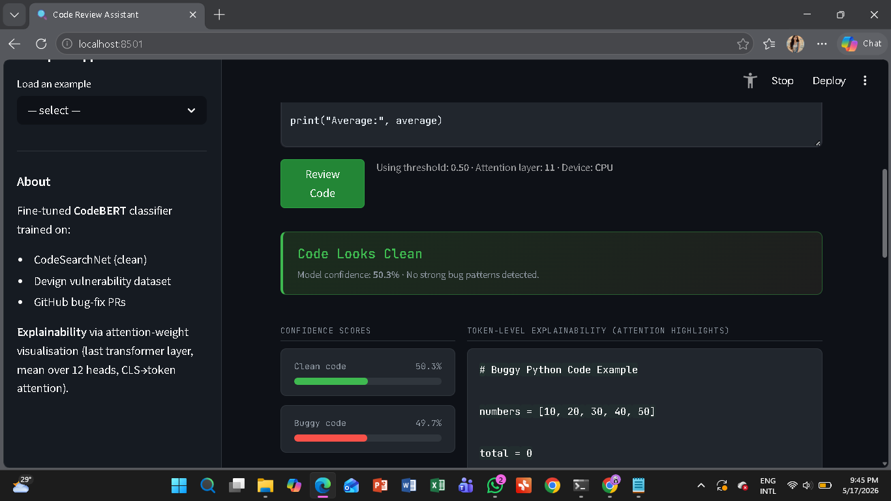
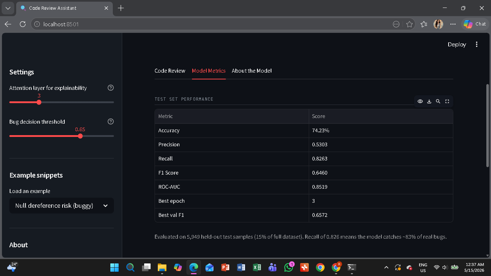

<div align="center">

# 🔍 Intelligent Code Review Assistant

**A deep learning–powered tool that detects bugs, vulnerabilities, and code smells in source code using fine-tuned CodeBERT**

[](https://python.org)
[](https://pytorch.org)
[](https://huggingface.co/microsoft/codebert-base)
[](https://streamlit.io)
[](LICENSE)
[]()

<br/>

> *Paste code. Get instant bug detection with token-level explainability.*

<br/>

| Accuracy | F1 Score | Recall | ROC-AUC |
|:---:|:---:|:---:|:---:|
| **74.2%** | **0.646** | **0.826** | **0.852** |

</div>

---

## 📋 Table of Contents

- [Overview](#-overview)
- [Demo](#-demo)
- [Model Architecture](#-model-architecture)
- [Dataset](#-dataset)
- [Project Structure](#-project-structure)
- [Pipeline](#-pipeline)
- [Installation](#-installation)
- [Usage](#-usage)
- [Notebooks](#-notebooks)
- [Evaluation Results](#-evaluation-results)
- [Explainability](#-explainability)
- [Dashboard Features](#-dashboard-features)
- [Limitations](#-limitations)
- [Future Work](#-future-work)

---

## 🧠 Overview

This project builds an end-to-end **automated code review system** that uses deep learning to detect bugs, vulnerabilities, and code smells in source code. It is an individual Data Science internship project completed over 4 weeks.

The system fine-tunes **[CodeBERT](https://huggingface.co/microsoft/codebert-base)** — a pre-trained transformer model for programming language understanding — on a combined labelled dataset of 39,656 code samples. The trained model is deployed as a **Streamlit web dashboard** that provides:

- ✅ Real-time **binary classification** (clean vs. buggy)
- 🎯 **Confidence scores** with adjustable decision threshold
- 🔍 **Token-level explainability** via attention weight visualisation
- 📊 **Model performance metrics** and training history

---

## 🎬 Demo

```
streamlit run app/app.py
```

> Screenshot: paste code → instant verdict + highlighted tokens

<!-- Add your dashboard screenshots below -->
| Code Review Tab | Metrics Tab |
|---|---|
|  |  |

---

## 🏗️ Model Architecture

```
Input code snippet (string)
        │
        ▼
CodeBERT Tokenizer  ──  WordPiece, vocab 50,265, max 512 tokens
        │
        ▼
CodeBERT Encoder  ──  12 transformer layers, 768-dim hidden state
  • Bottom 6 layers → FROZEN  (generic syntax features)
  • Top 6 layers   → TRAINABLE (task-specific features)
        │
        ▼
  [CLS] token hidden state  (768-dim)
        │
        ▼
  Dropout (p = 0.1)
        │
        ▼
  Linear (768 → 2)
        │
        ▼
  Softmax → P(clean),  P(buggy)
```

| Component | Detail |
|---|---|
| Base model | `microsoft/codebert-base` |
| Encoder layers | 12 (bottom 6 frozen) |
| Hidden size | 768 |
| Attention heads | 12 |
| Max token length | 512 |
| Dropout | 0.1 |
| Total parameters | 124,647,170 |
| Trainable parameters | 43,119,362 (34.6%) |

---

## 📦 Dataset

The model was trained on a combined dataset from three sources:

| Source | Language | Label | Samples |
|---|---|---|---|
| [CodeSearchNet](https://huggingface.co/datasets/code_search_net) | Python | Clean (0) | ~14,700 |
| [Devign](https://huggingface.co/datasets/google/code_x_glue_cc_defect_detection) | C | Mixed (0/1) | ~27,318 |
| GitHub Bug-Fix PRs | Python | Buggy (1) | ~6 |
| **Total** | | | **39,656** |

**Class distribution:** 2.5 : 1 (clean : buggy) → handled with weighted cross-entropy loss

**Class weights computed from training set:**
- Class 0 (clean): `0.6988`
- Class 1 (buggy): `1.7573`

---

## 📁 Project Structure

```
intelligent-code-review-assistant/
│
├── 📓 notebooks/
│   ├── 01_data_collection_eda.ipynb          # Jupyter (local) — data & EDA
│   ├── 02_preprocessing_tokenization.ipynb   # Jupyter (local) — tokenization
│   ├── 03_model_training.ipynb               # Google Colab (T4 GPU) — training
│   └── 04_evaluation.ipynb                   # Google Colab (T4 GPU) — evaluation
│
├── 🤖 models/
│   └── codebert_classifier/
│       ├── model.safetensors                 # Trained encoder weights
│       ├── classifier_head.pt                # Classification head weights
│       ├── tokenizer_config.json             # Tokenizer configuration
│       └── vocab.json                        # Tokenizer vocabulary
│
├── 🎛️ app/
│   └── app.py                                # Streamlit dashboard
│
├── 📊 data/
│   ├── raw/                                  # Downloaded/scraped raw data
│   │   ├── codesearchnet_python.csv
│   │   └── github_bug_fixes.csv
│   └── processed/                            # Tokenized splits + config
│       ├── train.pt
│       ├── val.pt
│       ├── test.pt
│       ├── class_weights.npy
│       └── preprocessing_config.pkl
│
├── 📈 reports/
│   ├── training_results.pkl                  # History, metrics, predictions
│   ├── classification_report.csv             # Per-class classification report
│   └── figures/                              # 20 saved visualization figures
│       ├── 01_label_distribution.png
│       ├── 02_samples_per_source.png
│       ├── 03_code_length_distribution.png
│       ├── 04_language_breakdown.png
│       ├── 05_boxplot_code_length.png
│       ├── 06_correlation_heatmap.png
│       ├── 07_token_length_distribution.png
│       ├── 08_token_distribution_splits.png
│       ├── 09_class_balance_splits.png
│       ├── 10_training_curves.png
│       ├── 11_test_evaluation.png
│       ├── 12_confidence_distribution.png
│       ├── 13_error_analysis.png
│       ├── 14_attention_true_positive.png
│       ├── 15_attention_false_negative.png
│       ├── 16_attention_true_negative.png
│       ├── 17_shap_bar.png
│       ├── 18_shap_waterfall_buggy.png
│       ├── 19_shap_waterfall_clean.png
│       └── 20_final_metrics_summary.png
│
├── Project_Report.pdf
├── requirements.txt
├── .gitignore
└── README.md
```

---

## 🔄 Pipeline

```
┌─────────────────────────────────────────────────────────────┐
│                      4-WEEK PIPELINE                        │
├──────────────┬──────────────┬──────────────┬────────────────┤
│   WEEK 1     │   WEEK 2     │   WEEK 3     │    WEEK 4      │
│  Notebook 01 │  Notebook 02 │  Notebook 03 │  Notebook 04   │
│  Jupyter     │  Jupyter     │  Colab (GPU) │  Colab (GPU)   │
├──────────────┼──────────────┼──────────────┼────────────────┤
│ • CodeSearch │ • clean_code │ • Load .pt   │ • Eval on test │
│   Net load   │   cleaning   │   datasets   │ • Confusion    │
│ • Devign     │ • CodeBERT   │ • Fine-tune  │   matrix       │
│   load       │   tokenise   │   CodeBERT   │ • ROC curve    │
│ • GitHub PR  │ • 70/15/15   │ • Weighted   │ • Attention    │
│   scraping   │   split      │   loss       │   viz          │
│ • EDA plots  │ • Save .pt   │ • Early stop │ • SHAP plots   │
│              │   tensors    │ • Save model │ • Dashboard    │
└──────────────┴──────────────┴──────────────┴────────────────┘
         │              │              │               │
         ▼              ▼              ▼               ▼
  39,656 labelled   tokenised     trained model    evaluation
    CSV dataset     .pt tensors   checkpoint       report
```

> **Notebooks 01 & 02** were run on a **local Jupyter Notebook** for data collection and preprocessing.
> **Notebooks 03 & 04** were run on **Google Colab (NVIDIA T4 GPU)** for faster model training and evaluation.

---

## ⚙️ Installation

### Prerequisites

- Python 3.10+
- Git
- 8GB+ RAM (16GB recommended for training)
- GPU optional for inference; required for retraining

### 1. Clone the repository

```bash
git clone https://github.com/nisansalasandu/intelligent-code-review-assistant.git
cd intelligent-code-review-assistant
```

### 2. Create and activate virtual environment

```bash
# Windows
python -m venv venv
venv\Scripts\activate

# macOS / Linux
python -m venv venv
source venv/bin/activate
```

### 3. Install dependencies

```bash
pip install --upgrade pip
pip install -r requirements.txt
```

### 4. Verify installation

```bash
python -c "import torch, transformers, streamlit; print('✅ All good')"
```

### requirements.txt

```
torch>=2.0.0
transformers>=4.40.0
datasets>=2.0.0
streamlit>=1.28.0
scikit-learn>=1.0.0
shap>=0.45.0
PyGithub>=2.0.0
matplotlib>=3.7.0
seaborn>=0.12.0
pandas>=2.0.0
numpy>=1.24.0
safetensors>=0.4.0
tqdm>=4.65.0
huggingface-hub>=0.20.0
jupyter>=7.0.0
mlflow>=2.0.0
```

---

## 🚀 Usage

### Run the Streamlit dashboard

```bash
streamlit run app/app.py
```

The app opens at `http://localhost:8501` in your browser.

### Quick inference (Python API)

```python
import torch
from transformers import AutoTokenizer
# Load tokenizer and model (see app/app.py for full CodeBERTClassifier class)

tokenizer = AutoTokenizer.from_pretrained("models/codebert_classifier")

code = """
def calculate_average(numbers):
    return sum(numbers) / len(numbers)   # bug: crashes if numbers is empty
"""

# Tokenize
enc = tokeniser(code, return_tensors="pt", max_length=512,
                padding="max_length", truncation=True)

# Run model
with torch.no_grad():
    output = model(**enc)
    probs  = torch.softmax(output["logits"], dim=-1)

print(f"P(clean) = {probs[0][0]:.3f}")
print(f"P(buggy) = {probs[0][1]:.3f}")
```

---

## 📓 Notebooks

Run the notebooks **in order**. Notebooks 01–02 run locally; 03–04 on Google Colab.

| # | Notebook | Environment | Input | Output |
|---|---|---|---|---|
| 01 | `01_data_collection_eda.ipynb` | Jupyter (local) | HuggingFace Hub, GitHub API | `data/processed/labeled_dataset_full.csv` |
| 02 | `02_preprocessing_tokenization.ipynb` | Jupyter (local) | `labeled_dataset_full.csv` | `data/processed/train.pt`, `val.pt`, `test.pt` |
| 03 | `03_model_training.ipynb` | Google Colab T4 | `train.pt`, `val.pt` | `models/codebert_classifier/`, `training_results.pkl` |
| 04 | `04_evaluation.ipynb` | Google Colab T4 | `test.pt`, trained model | Metrics, SHAP plots, attention visualizations |

### Running Notebooks 03 & 04 on Google Colab

```python
# Step 1: Mount Google Drive in Colab
from google.colab import drive
drive.mount('/content/drive')

# Step 2: Copy processed data from Drive
import shutil
shutil.copytree('/content/drive/MyDrive/code-review/data', 'data')

# Step 3: Install dependencies
!pip install transformers>=4.40.0 datasets torch scikit-learn shap -q

# Step 4: Run all cells
```

### GitHub Token Setup (Notebook 01)

```bash
# Set as environment variable (never hardcode in notebook)
export GITHUB_TOKEN="your_token_here"          # macOS/Linux
set GITHUB_TOKEN=your_token_here               # Windows
```

Get a free token at [github.com/settings/tokens](https://github.com/settings/tokens) → Generate new token (classic) → scope: `public_repo` only.

---

## 📊 Evaluation Results

### Test Set Performance (5,949 samples)

| Metric | Score | Notes |
|---|---|---|
| **Accuracy** | 74.23% | Majority-class baseline: 71.6% |
| **Precision** | 0.5303 | 53% of flagged code is truly buggy |
| **Recall** | 0.8263 | Catches 82.6% of all real bugs ✅ |
| **F1 Score** | 0.6460 | Harmonic mean |
| **ROC-AUC** | 0.8519 | Strong discrimination ability |

### Training History (6 epochs)

| Epoch | Train Loss | Val Loss | Val F1 | Val ROC-AUC |
|:---:|:---:|:---:|:---:|:---:|
| 1 | 0.4959 | 0.4448 | 0.6345 | 0.8209 |
| 2 | 0.4522 | 0.4921 | 0.6222 | 0.8410 |
| **3 ★** | **0.4227** | **0.4586** | **0.6572** | **0.8552** |
| 4 | 0.3838 | 0.5310 | 0.6336 | 0.8593 |
| 5 | 0.3445 | 0.5585 | 0.6328 | 0.8624 |
| 6 | 0.3082 | 0.7416 | 0.6095 | 0.8623 |

> ★ Best checkpoint saved at **epoch 3** (early stopping on validation F1, patience=2)

### Training Configuration

| Hyperparameter | Value |
|---|---|
| Optimizer | AdamW |
| Learning rate | 2e-5 |
| Batch size | 16 |
| Gradient accumulation | 4 steps |
| Warmup ratio | 0.1 |
| Scheduler | Linear warmup + decay |
| Loss function | Weighted CrossEntropyLoss |
| Frozen encoder layers | Bottom 6 of 12 |
| Early stopping patience | 2 epochs |

---

## 🔍 Explainability

The dashboard provides two types of explainability:

### 1. Attention-Based Token Highlighting

For each prediction, attention weights from the last CodeBERT transformer layer are extracted, averaged across 12 heads, and projected from the `[CLS]` token to every input token. High-attention tokens are highlighted:

- 🔴 **Red intensity** → token pushed prediction toward **buggy**
- 🟢 **Green intensity** → token pushed prediction toward **clean**

```
Method:
  attention = last_layer_attention[0]        # shape: (heads, seq, seq)
  cls_attn  = attention.mean(dim=0)[0, :]   # mean over heads, CLS row
  scores    = normalise(cls_attn, 0, 1)     # scale to [0, 1]
```

### 2. SHAP Analysis (Notebook 04)

SHAP (SHapley Additive exPlanations) values were computed on a sample of test predictions to provide theoretically grounded feature attribution. SHAP satisfies consistency and efficiency axioms that attention weights do not guarantee.

---

## 🎛️ Dashboard Features

### Code Review Tab
- 📥 **Code input** — paste any Python or C code snippet
- 🚨 **Verdict banner** — red (buggy) / green (clean) with confidence %
- 📊 **Confidence bars** — P(clean) and P(buggy) visual bars
- 🎨 **Token highlights** — colour-coded attention visualization
- 📋 **Top-15 tokens table** — most-attended tokens with scores
- 🔢 **Raw JSON output** — full model output for debugging
- 💡 **5 example snippets** — pre-loaded buggy and clean examples

### Sidebar Controls
- 🎚️ **Decision threshold** — adjustable from 0.10 to 0.90 (default 0.50)
- 🔢 **Attention layer** — selectable transformer layer 0–11 for explainability

### Model Metrics Tab
- 📈 Training curves (loss, F1, precision/recall, ROC-AUC over epochs)
- 🟦 Confusion matrix on test set
- 📉 Confidence distribution by true label
- 📋 Full classification report

---

## ⚠️ Limitations

- **Language bias** — buggy samples are predominantly C (Devign), clean samples are Python (CodeSearchNet). May underperform on Python-specific bugs.
- **512-token limit** — functions longer than ~200 lines are truncated; only the first 512 tokens are analysed.
- **Binary classification only** — detects presence of bugs but does not categorise bug type or suggest fixes.
- **Attention ≠ causation** — attention highlights are approximate explanations, not guaranteed causal attributions (Jain & Wallace, 2019).
- **GitHub scraper yield** — PR label inconsistencies across repositories limited Python bug-fix collection to very few samples.

---

## 🔭 Future Work

- [ ] Fine-tune **GraphCodeBERT** with data flow graph information for improved structural understanding
- [ ] Train **CodeT5+** seq2seq model to generate fix suggestions alongside detection
- [ ] Multi-class bug categorisation (null dereference, off-by-one, buffer overflow, logic error)
- [ ] **VS Code extension** for in-editor real-time code review
- [ ] **GitHub Actions** CI/CD integration — auto-review on pull requests
- [ ] Replace attention with **Integrated Gradients** for theoretically grounded explainability
- [ ] Expand training data with **BigVul** / **ReVeal** datasets for broader vulnerability coverage
- [ ] Add **Docker** containerisation for consistent deployment

---


## 📄 License

This project is licensed under the MIT License — see the [LICENSE](LICENSE) file for details.

---

<div align="center">

**Built as an individual Data Science internship project · 4-week timeline**

*[Your Name] · [Company Name] · [Year]*

</div>
